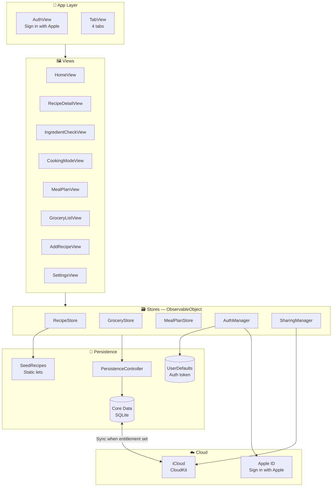
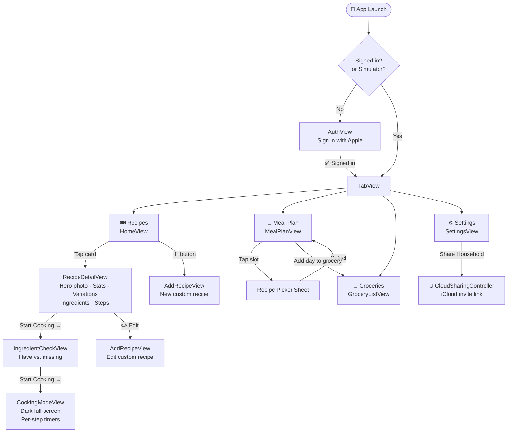
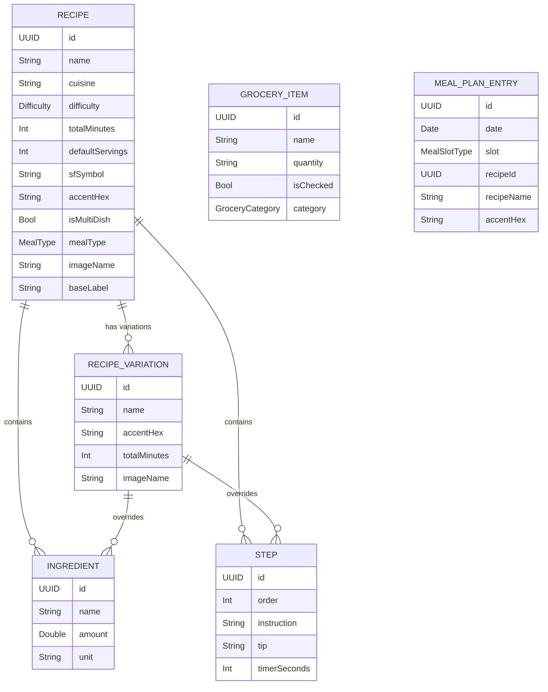
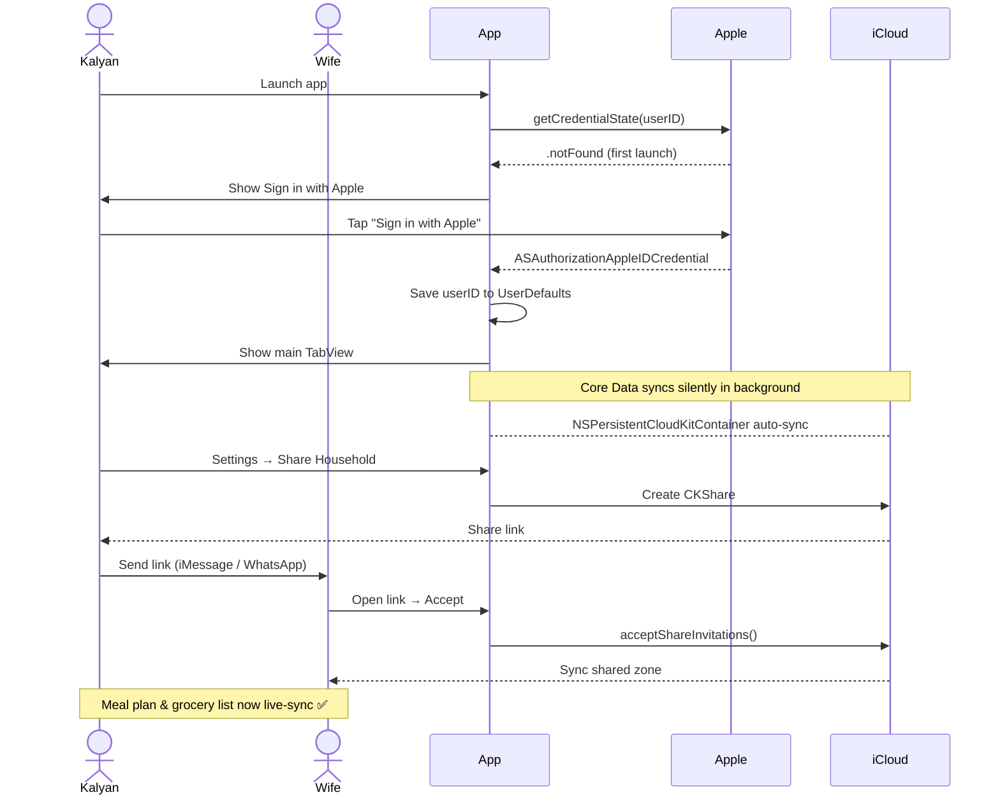
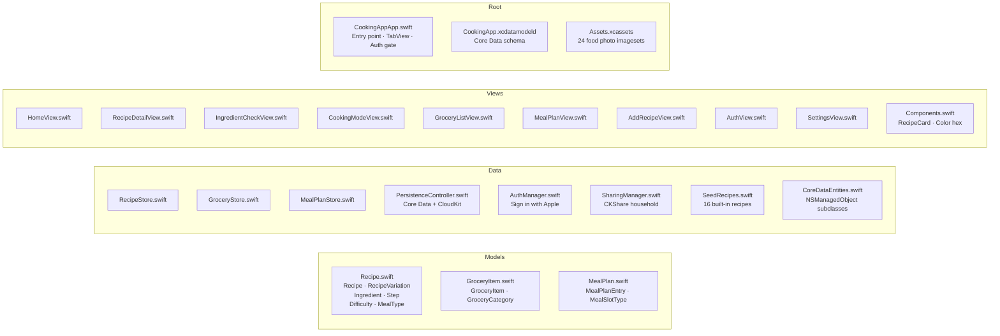

# 🍳 CookingApp

> **Personal iOS recipe app** — plan meals, cook step-by-step, share your grocery list with your household, and build your own recipe collection.

---

## 📋 Summary

CookingApp is a native **SwiftUI iOS 17+** app built for Kalyan and his household. It replaces scattered recipe bookmarks and WhatsApp grocery lists with a single app that ties together recipes, weekly meal planning, a shared grocery list, and step-by-step cooking mode with per-step timers.

The app is fully **offline-first** — all data lives in Core Data on-device. When iCloud entitlements are configured, it syncs automatically in the background via **NSPersistentCloudKitContainer**. Household sharing works through **CloudKit CKShare**, so both phones stay in sync in real time without any manual export.

> [!info] Repo & Platform
> **GitHub:** https://github.com/kalyanindianapolis-web/CookingApp
> **Platform:** iOS 17+ · SwiftUI · Swift 5.9+ · Xcode 16+
> **Last updated:** 2026-05-30

---

## 🏗️ Architecture



---

## 📱 Navigation Flow



---

## 🗂️ Data Model



> [!note] Storage
> - **Seed recipes** (built-in) → static Swift lets in `SeedRecipes.swift`. Never stored in Core Data.
> - **User recipes** → `RecipeEntity` in Core Data (JSON blob per recipe).
> - **Grocery items** → `GroceryItemEntity` — individual attributes, syncs item-by-item.
> - **Meal plan entries** → `MealPlanEntryEntity` — individual attributes, syncs entry-by-entry.

---

## ☁️ Login & Household Sharing



> [!warning] iCloud Setup Required
> To activate sync and sharing, add these in Xcode → Target → Signing & Capabilities:
> 1. **iCloud** → enable CloudKit → create container `iCloud.com.kalyan.CookingApp`
> 2. **Sign in with Apple**
>
> Without these, the app runs fully offline (local Core Data only) and the simulator bypasses the login gate automatically.

---

## 📚 Recipe Library  

**16 recipe cards** · **14 variations** across 2 parent recipes

### 🍳 Breakfast (3 cards)

| Recipe | Difficulty | Time | Notes |
|--------|-----------|------|-------|
| Paneer Dahi Sandwich | Easy | 35 min | Classic |
| **Chia Seed Pudding** | Easy | 125 min | 6 flavour variations |
| Chilli Cheese Corn Sandwich | Easy | 20 min | Triple-decker, streety chutney |

**Chia variations:** Base · Mango Coconut · Orange Creamsicle · Very Berry · Apple Pie · Pumpkin Spice · Chocolate Banana

---

### 🍽️ Lunch & Dinner (13 cards)

| Recipe | Cuisine | Difficulty | Time | Notes |
|--------|---------|-----------|------|-------|
| Dal Tadka | North Indian | Medium | 45 min | Two-tadka dhaba style |
| Jeera Rice | North Indian | Easy | 20 min | Wok-tossed |
| Bagara Rice | Hyderabadi | Easy | 65 min | Whole-spice basmati |
| Chana Masala | North Indian | Medium | — | |
| Aloo Gobi | North Indian | Easy | — | |
| **Paneer** | North Indian | Medium | 45 min | 7 variations (see below) |
| Kaju Masala | North Indian | Medium | 50 min | Cashew gravy |
| Rajma Masala | North Indian | Medium | — | Dhaba style |
| Pani Puri Pani | Indian Street Food | Easy | 25 min | Mint-tamarind water |
| Masala Puri | Indian Street Food | Medium | 40 min | Dry peas + tamarind masala |
| **Phuchka & Churmur** | Indian Street Food | Hard | 45 min | Multi-dish · Kolkata style |
| Thecha Paneer Rice | Maharashtrian | Easy | 35 min | Charred chilli-garlic paste |
| Paneer Hot Garlic Sauce & Fried Rice | Indo-Chinese | Medium | 40 min | Multi-dish · Wok hei |

**Paneer variations:** Lababdar (base) · Butter Masala · Chilli Paneer · Makhani Burger · Spicy Burger · Do Pyaaza · Palak Paneer · Kaju Masala

---

## ✅ Features Built

### Core
- [x] Recipe grid with search (by name and ingredient) and cuisine filter chips
- [x] Variation picker — horizontal chip row; swaps ingredients, steps, accent colour, and hero photo
- [x] Servings scaler — auto-scales all ingredient amounts with smart fraction display (½, ¾, etc.)
- [x] Ingredient check view — shows have vs. missing; adds missing items to grocery list in one tap
- [x] Cooking mode — dark full-screen step-by-step with per-step countdown timers
- [x] Timer warning when navigating away from a running step
- [x] Weekly meal planner — assign Breakfast / Lunch / Dinner per day; "Add day to grocery list"
- [x] Grocery list — categorised, tap to check/uncheck, swipe to delete, clear checked
- [x] Add / edit custom recipes — name, icon, cuisine, difficulty, time, servings, colour, ingredients, steps

### Photos
- [x] Real food photos on all seed recipe cards (Unsplash free licence)
- [x] Unique photo per Paneer variation (8 photos)
- [x] Unique photo per Chia Seed Pudding variation (7 photos)
- [x] Tapping a variation chip swaps the hero photo

### Login & Sync
- [x] Sign in with Apple gate (bypassed on simulator automatically)
- [x] Core Data persistence (replaces UserDefaults; one-time migration on first update)
- [x] NSPersistentCloudKitContainer — auto-syncs to iCloud when entitlement is set
- [x] Household sharing via CloudKit CKShare — invite link through `UICloudSharingController`
- [x] Settings tab — account info, share/manage household, sign out

### UX Polish
- [x] Variation accent colour flows through hero gradient, step numbers, timer text, Start Cooking button
- [x] Smart grocery category inference (70+ Indian pantry keywords)
- [x] Edit / delete only visible on user-added recipes
- [x] Toast banner in Meal Plan after adding day to grocery list
- [x] "You're all set!" success banner in Ingredient Check when everything is on the list
- [x] Keyboard Done button on decimal pad fields in AddRecipeView

---

## 🔲 What's Left

### Recipes
- [ ] More breakfast options (oats, parathas, idli/dosa, smoothies)
- [ ] Snacks / drinks category (no MealType for it yet)

### Features
- [ ] **Meal plan → variation picker** — no way to pick *which* Paneer or Chia variation you plan to cook
- [ ] **Grocery deduplication** — if two day's recipes share an ingredient, quantities are not summed
- [ ] **Recipe search across variations** — search only checks base recipe ingredients, not variations
- [ ] **User recipe photos** — AddRecipeView has no photo picker; user recipes show SF Symbol fallback
- [ ] **Reorder ingredients / steps** — swipe-to-delete exists but no drag reorder in AddRecipeView
- [ ] **Nutrition info** — no calorie or macro tracking
- [ ] **Share / export recipe** — no way to share a recipe card outside the app

### Technical
- [ ] **iCloud entitlements** — must be added manually in Xcode Signing & Capabilities (see setup note above)
- [ ] SourceKit shows false-positive errors throughout (SourceKit indexer lag — all `xcodebuild` builds succeed)

---

## 🗺️ File Map



| File | Lines | Purpose |
|------|-------|---------|
| `Data/SeedRecipes.swift` | ~1280 | All 16 built-in recipes as static lets |
| `Models/Recipe.swift` | 161 | Core model structs |
| `Views/RecipeDetailView.swift` | 290 | Hero, variation picker, ingredients, steps |
| `Views/CookingModeView.swift` | — | Dark step-by-step with countdown timers |
| `Data/PersistenceController.swift` | ~100 | Core Data + CloudKit container |
| `CookingApp.xcdatamodeld` | — | 3 entities: RecipeEntity, GroceryItemEntity, MealPlanEntryEntity |

---

## 🔑 UserDefaults Keys (Auth only)

| Key | Used by | Purpose |
|-----|---------|---------|
| `siwa_userID` | AuthManager | Apple user ID for credential re-validation |
| `siwa_displayName` | AuthManager | Display name from first sign-in |

> [!note] Data migration
> On first launch after the Core Data update, `PersistenceController.migrateLegacyDataIfNeeded()` reads `"userRecipes"`, `"groceryItems"`, and `"mealPlanEntries"` from UserDefaults and imports them into Core Data, then clears those keys. No data is lost on update.

---

## 🧩 Key Patterns

### Variation swapping
```swift
// Recipe.applying(_:) returns a merged copy with variation's data
private var effectiveRecipe: Recipe {
    selectedVariation.map { recipe.applying($0) } ?? recipe
}
// heroImage, ingredients, steps, accent colour all read effectiveRecipe
```

### CloudKit guard (no entitlement = no crash)
```swift
static var cloudKitEnabled: Bool {
    let ids = Bundle.main.object(forInfoDictionaryKey:
        "com.apple.developer.icloud-container-identifiers") as? [String]
    return ids?.isEmpty == false
}
// All CKContainer calls are guarded: if PersistenceController.cloudKitEnabled { … }
```

### Smart grocery categories
```swift
GroceryCategory.infer(from: "toor dal")   // → .legumes
GroceryCategory.infer(from: "kasuri methi") // → .herbs
GroceryCategory.infer(from: "paneer")     // → .dairy
```
