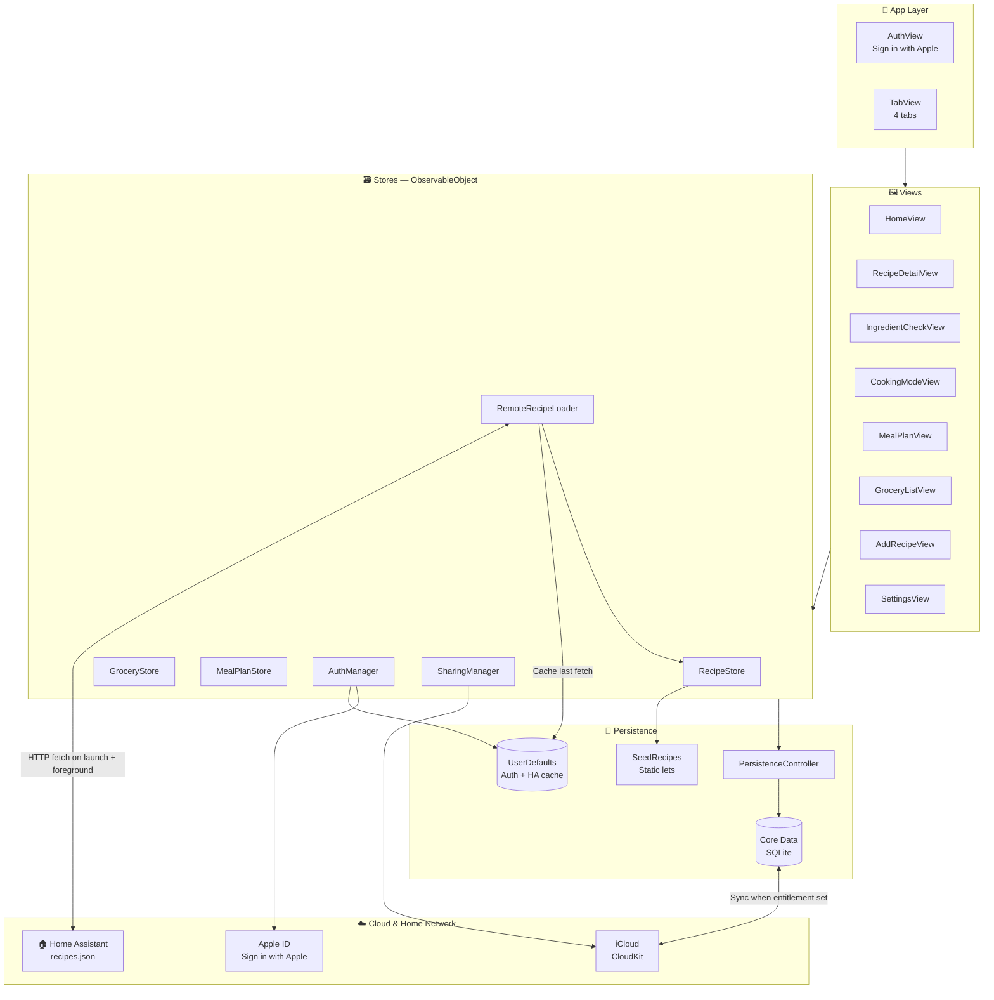
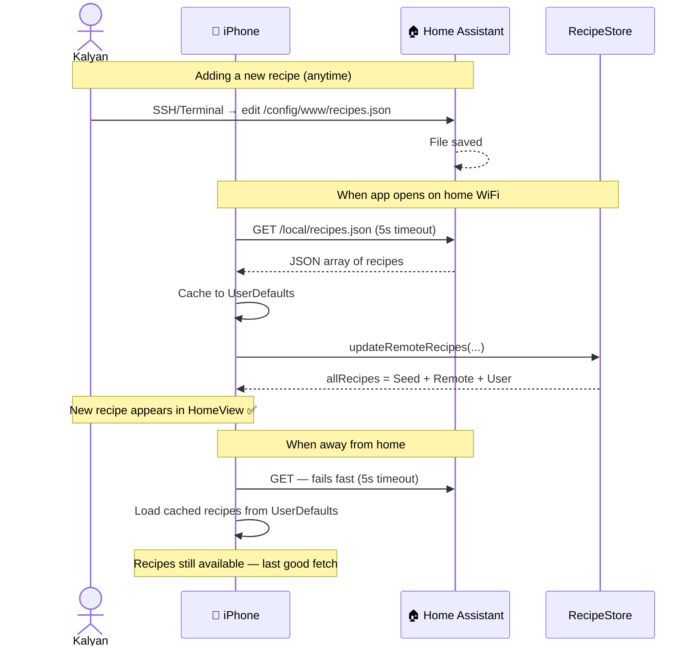
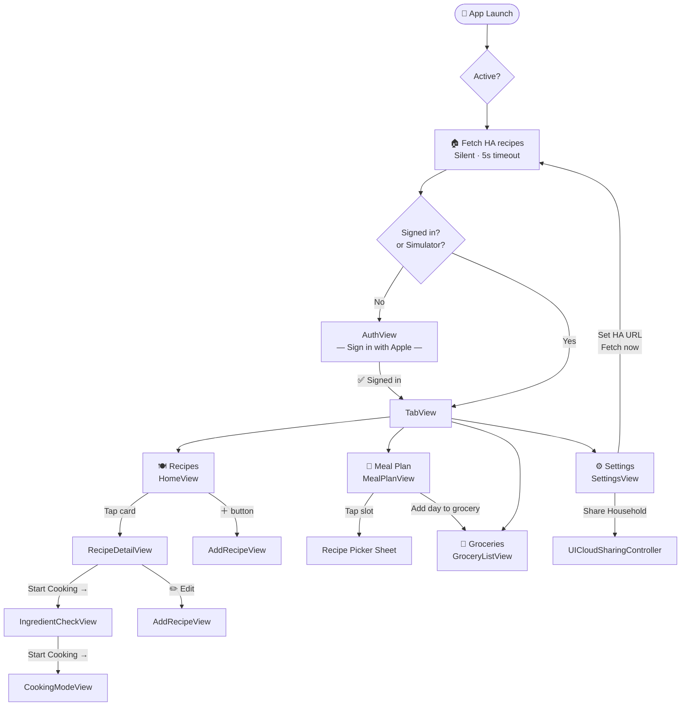
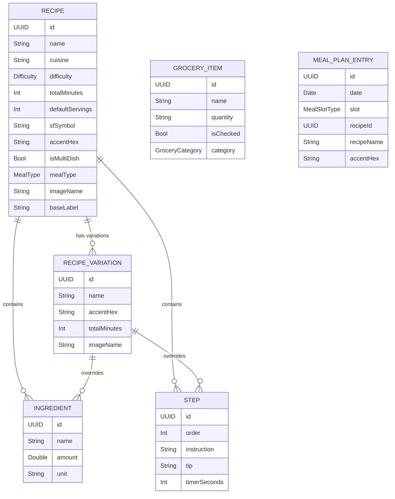
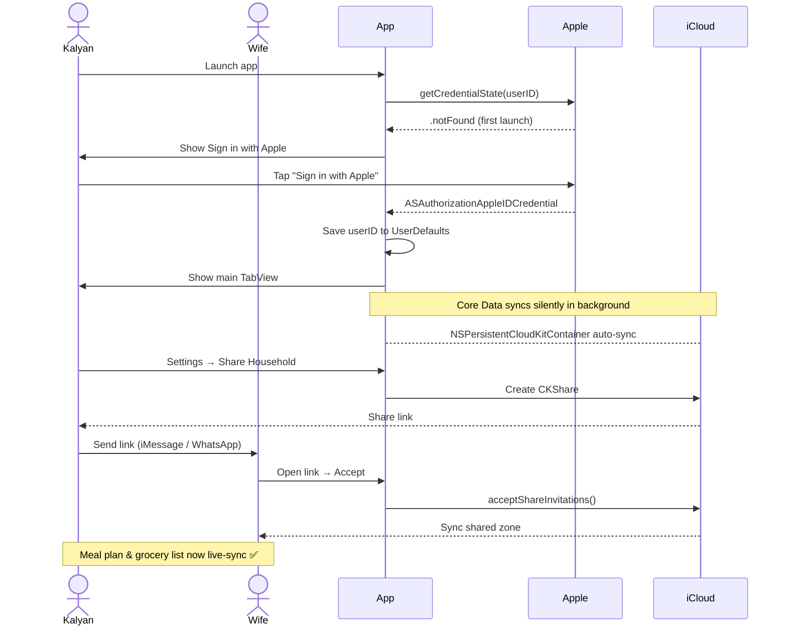
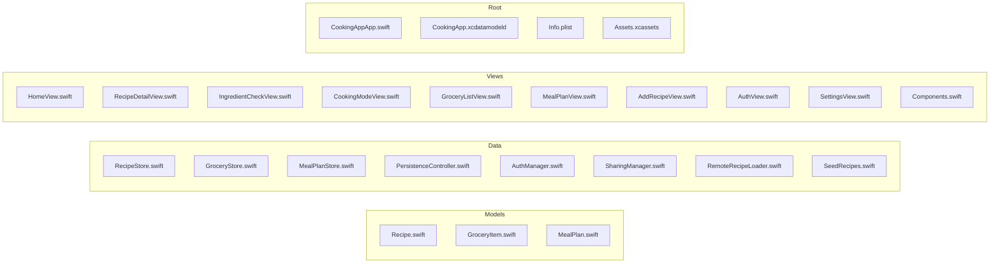

# 🍳 CookingApp

> **Personal iOS recipe app** — plan meals, cook step-by-step, share your grocery list with your household, build your own recipe collection, and load new recipes from Home Assistant **without ever pushing a new app version**.

---

## 📋 Summary

CookingApp is a native **SwiftUI iOS 17+** app built for Kalyan and his household. It replaces scattered recipe bookmarks and WhatsApp grocery lists with a single app that ties together:

- 🍳 **Recipes** — with photos, variations, scaled servings, and per-step countdown timers
- 📅 **Weekly meal planning** — assign breakfast/lunch/dinner per day
- 🛒 **Smart grocery list** — auto-categorized, with one-tap "add missing ingredients" from any recipe
- 👨‍👩‍👧 **Household sharing** — meal plan + grocery list live-sync between both phones via iCloud
- 🏠 **Home Assistant recipe sync** — add a new recipe to a JSON file on HA and it appears in the app automatically when you're on home WiFi

The app is **offline-first** — everything works without internet. iCloud sync happens silently in the background. Home Assistant is the recipe CMS so you never have to rebuild the app to add a recipe.

> [!info] Repo & Platform
> **GitHub:** https://github.com/kalyanindianapolis-web/CookingApp
> **Platform:** iOS 17+ · SwiftUI · Swift 5.9+ · Xcode 16+
> **Home Assistant:** `http://192.168.86.102:8123`
> **Last updated:** 2026-05-30

---

## 🏗️ Architecture



---

## 🏠 Home Assistant Recipe Sync (NEW)

This is the magic that lets you add a recipe without rebuilding the app.



### How it works

| Component | Role |
|-----------|------|
| `Data/RemoteRecipeLoader.swift` | Fetches `recipes.json`, decodes, caches, exposes `@Published recipes` |
| `CookingAppApp.swift` | Triggers `fetchIfReachable()` on `scenePhase == .active` |
| `RecipeStore.allRecipes` | Concatenates seed + remote (deduped by ID) + user recipes |
| `SettingsView` | Lets you change the URL and manually trigger a fetch |
| `Info.plist` | `NSAllowsLocalNetworking = YES` + `NSLocalNetworkUsageDescription` + Bonjour |

### Adding a new recipe (the new workflow)

> [!tip] No code change. No new app build. No App Store re-submission.
> Just edit one JSON file on HA and the recipe appears next time the app opens at home.

1. SSH into HA (via Terminal addon at `http://192.168.86.102:8123`)
2. Edit `/config/www/recipes.json` — use `nano` or the **File Editor** addon
3. Add a new object to the array (template in `MD files/HA-recipes-template.json`)
4. Save → next app launch on home WiFi shows the new recipe

### JSON schema (per recipe)

```json
{
  "name": "Recipe Name",
  "cuisine": "North Indian",
  "difficulty": "Easy | Medium | Hard",
  "totalMinutes": 30,
  "defaultServings": 4,
  "sfSymbol": "fork.knife",
  "accentHex": "F59E0B",
  "isMultiDish": false,
  "mealType": "Breakfast | Lunch & Dinner",
  "ingredients": [
    { "name": "Toor dal", "amount": 1, "unit": "cup" }
  ],
  "steps": [
    {
      "order": 1,
      "instruction": "Wash the dal.",
      "tip": "Optional tip.",
      "timerSeconds": 300
    }
  ]
}
```

> [!note] Stable IDs
> The app derives a deterministic UUID from the recipe name (`ha:<name>`), so the **same recipe always gets the same internal ID** — re-fetching doesn't create duplicates, and updates flow through cleanly.

---

## 📱 Navigation Flow



---

## 🗂️ Data Model



### Storage matrix

| Data | Where | Lifecycle |
|------|-------|-----------|
| **Seed recipes** | Static Swift lets in `SeedRecipes.swift` | Ships with the app, never changes at runtime |
| **HA remote recipes** | UserDefaults cache (`ha_remote_recipes_cache`) | Refetched on every foreground; persists offline |
| **User-added recipes** | `RecipeEntity` in Core Data (JSON blob) | Synced to iCloud · shared via CKShare |
| **Grocery items** | `GroceryItemEntity` in Core Data | Synced to iCloud · shared via CKShare |
| **Meal plan entries** | `MealPlanEntryEntity` in Core Data | Synced to iCloud · shared via CKShare |
| **Auth state** | UserDefaults (`siwa_userID`, `siwa_displayName`) | Per-device |
| **HA URL config** | UserDefaults (`ha_recipe_url`) | Per-device |

---

## ☁️ Login & Household Sharing



> [!warning] iCloud Setup Required
> To activate sync and sharing, add these in Xcode → Target → Signing & Capabilities:
> 1. **iCloud** → enable CloudKit → create container `iCloud.com.kalyan.CookingApp`
> 2. **Sign in with Apple**
>
> Without these the app runs fully offline (local Core Data only). The simulator bypasses the login gate automatically.

---

## 📚 Recipe Library

**16 built-in recipes** · **14 variations** across 2 parent recipes · plus unlimited recipes via HA

### 🍳 Breakfast (3 cards)

| Recipe | Difficulty | Time | Notes |
|--------|-----------|------|-------|
| Paneer Dahi Sandwich | Easy | 35 min | Classic |
| **Chia Seed Pudding** | Easy | 125 min | 6 flavour variations |
| Chilli Cheese Corn Sandwich | Easy | 20 min | Triple-decker, streety chutney |

**Chia variations:** Base · Mango Coconut · Orange Creamsicle · Very Berry · Apple Pie · Pumpkin Spice · Chocolate Banana

---

### 🍽️ Lunch & Dinner (13 cards)

| Recipe | Cuisine | Difficulty | Time | Notes |
|--------|---------|-----------|------|-------|
| Dal Tadka | North Indian | Medium | 45 min | Two-tadka dhaba style |
| Jeera Rice | North Indian | Easy | 20 min | Wok-tossed |
| Bagara Rice | Hyderabadi | Easy | 65 min | Whole-spice basmati |
| Chana Masala | North Indian | Medium | — | |
| Aloo Gobi | North Indian | Easy | — | |
| **Paneer** | North Indian | Medium | 45 min | 7 variations |
| Kaju Masala | North Indian | Medium | 50 min | Cashew gravy |
| Rajma Masala | North Indian | Medium | — | Dhaba style |
| Pani Puri Pani | Indian Street Food | Easy | 25 min | Mint-tamarind water |
| Masala Puri | Indian Street Food | Medium | 40 min | Dry peas + tamarind masala |
| **Phuchka & Churmur** | Indian Street Food | Hard | 45 min | Multi-dish · Kolkata style |
| Thecha Paneer Rice | Maharashtrian | Easy | 35 min | Charred chilli-garlic paste |
| Paneer Hot Garlic Sauce & Fried Rice | Indo-Chinese | Medium | 40 min | Multi-dish · Wok hei |

**Paneer variations:** Lababdar (base) · Butter Masala · Chilli Paneer · Makhani Burger · Spicy Burger · Do Pyaaza · Palak Paneer · Kaju Masala

---

## ✅ Features Built

### Core
- [x] Recipe grid with search (name + ingredient) and cuisine filter chips
- [x] Variation picker — swaps ingredients, steps, accent colour, hero photo
- [x] Servings scaler with smart fraction display (½, ¾, etc.)
- [x] Ingredient check view — have vs. missing, one-tap add to grocery list
- [x] Cooking mode — dark full-screen step-by-step with countdown timers
- [x] Timer warning when navigating away from a running step
- [x] Weekly meal planner — assign B/L/D per day; "Add day to grocery list"
- [x] Grocery list — categorised, tap check, swipe delete, clear checked
- [x] Add / edit custom recipes — full form including ingredients & steps

### Photos
- [x] Real food photos on all seed recipes (Unsplash free licence)
- [x] Unique photo per Paneer variation (8 photos)
- [x] Unique photo per Chia variation (7 photos)
- [x] Tapping a variation chip swaps the hero photo

### Login & Sync
- [x] Sign in with Apple gate (auto-bypassed on simulator)
- [x] Core Data persistence (replaces UserDefaults; one-time migration)
- [x] NSPersistentCloudKitContainer — silent iCloud sync when entitlement set
- [x] Household sharing via CloudKit CKShare → `UICloudSharingController`
- [x] Settings tab — account info, share/manage household, sign out

### 🏠 Home Assistant (NEW)
- [x] Auto-fetches `recipes.json` from local HA URL on launch + foreground
- [x] Configurable URL in Settings (default `http://homeassistant.local:8123/local/recipes.json`)
- [x] 5-second timeout — fails silently when away from home
- [x] UserDefaults cache so recipes persist offline
- [x] Deduplicated stable UUIDs derived from recipe name
- [x] Info.plist allows HTTP to local network + mDNS Bonjour discovery
- [x] HA template JSON in `MD files/HA-recipes-template.json`

### UX Polish
- [x] Variation accent colour flows through hero, step numbers, timer, button
- [x] Smart grocery category inference (70+ Indian pantry keywords)
- [x] Edit / delete visible only on user-added recipes
- [x] Toast banner in Meal Plan after adding day to grocery list
- [x] "You're all set!" success banner in Ingredient Check
- [x] Keyboard Done button on decimal pad fields

---

## 🏠 Home Assistant Setup (One-Time)

### Step 1 — Install Terminal addon
**Settings → Add-ons → Add-on Store → "Terminal & SSH"** → Install → Start → Open Web UI

### Step 2 — Create the recipes.json file
In the terminal:
```bash
mkdir -p /config/www && printf '%s' '[]' > /config/www/recipes.json && echo "Done ✓"
```

### Step 3 — Restart HA
`Settings → System → Restart` (so HA registers the `/local/` static route)

### Step 4 — Verify
`http://192.168.86.102:8123/local/recipes.json` should return `[]`

### Step 5 — Configure the app
In CookingApp → **Settings → Home Assistant Recipes** → set URL to `http://192.168.86.102:8123/local/recipes.json` → tap **Fetch now**

---

## 🔲 What's Left

### Recipes
- [ ] More breakfast options (oats, parathas, idli/dosa, smoothies)
- [ ] Snacks / drinks category (no MealType for it yet)

### Features
- [ ] **Meal plan → variation picker** — can't pick which Paneer/Chia variation you plan to cook
- [ ] **Grocery deduplication** — same ingredient across two recipes isn't summed
- [ ] **Recipe search across variations** — only checks base recipe
- [ ] **User recipe photos** — AddRecipeView has no photo picker
- [ ] **Reorder ingredients/steps** — no drag reorder in AddRecipeView
- [ ] **Nutrition info** — no calorie/macro tracking
- [ ] **Share / export recipe** — no card export
- [ ] **HA recipe photos** — JSON can reference asset names but no remote image download yet

### Technical
- [ ] **iCloud entitlements** — must be added manually in Xcode (see callout above)
- [ ] **HA remote access** — works only on home WiFi unless you expose HA via Nabu Casa or VPN
- [ ] SourceKit shows false-positive errors throughout — all `xcodebuild` builds succeed

---

## 🗺️ File Map



| File | Purpose |
|------|---------|
| `Data/SeedRecipes.swift` | All 16 built-in recipes as static lets |
| `Data/RemoteRecipeLoader.swift` | **HA recipe fetcher** — HTTP + cache + dedup |
| `Data/PersistenceController.swift` | Core Data + CloudKit container |
| `Data/SharingManager.swift` | CloudKit CKShare household sharing |
| `Data/AuthManager.swift` | Sign in with Apple state |
| `Models/Recipe.swift` | Recipe, RecipeVariation, Ingredient, Step |
| `Views/RecipeDetailView.swift` | Hero, variation picker, ingredients, steps |
| `Views/SettingsView.swift` | Account, household, **HA URL config** |
| `CookingApp.xcdatamodeld` | 3 Core Data entities |
| `Info.plist` | Local network permissions + standard iOS keys |

---

## 🔑 UserDefaults Keys

| Key | Used by | Purpose |
|-----|---------|---------|
| `siwa_userID` | AuthManager | Apple user ID for credential re-validation |
| `siwa_displayName` | AuthManager | Display name from first sign-in |
| `ha_recipe_url` | RemoteRecipeLoader | Configurable HA URL |
| `ha_remote_recipes_cache` | RemoteRecipeLoader | Last successful JSON fetch (offline fallback) |

---

## 🧩 Key Patterns

### Variation swapping
```swift
private var effectiveRecipe: Recipe {
    selectedVariation.map { recipe.applying($0) } ?? recipe
}
// heroImage, ingredients, steps, accent colour all read effectiveRecipe
```

### CloudKit guard (no entitlement = no crash)
```swift
static var cloudKitEnabled: Bool {
    let ids = Bundle.main.object(forInfoDictionaryKey:
        "com.apple.developer.icloud-container-identifiers") as? [String]
    return ids?.isEmpty == false
}
```

### HA fetch (silent fail when away)
```swift
var request = URLRequest(url: url)
request.timeoutInterval = 5   // fail fast if not on home network
URLSession.shared.dataTask(with: request) { data, _, _ in
    guard let data, let recipes = parse(data) else { return }
    self.recipes = recipes
    UserDefaults.standard.set(data, forKey: cacheKey)
}.resume()
```

### Stable UUIDs for HA recipes
```swift
// Same recipe name → same UUID across fetches, no duplicates
private func stableID(for name: String) -> UUID {
    let seed = Data("ha:\(name.lowercased())".utf8)
    var bytes = [UInt8](repeating: 0, count: 16)
    for (i, byte) in seed.enumerated() { bytes[i % 16] ^= byte }
    bytes[6] = (bytes[6] & 0x0F) | 0x40  // version 4
    bytes[8] = (bytes[8] & 0x3F) | 0x80  // variant
    return UUID(uuid: (/* ... */))
}
```

### Smart grocery categories
```swift
GroceryCategory.infer(from: "toor dal")     // → .legumes
GroceryCategory.infer(from: "kasuri methi") // → .herbs
GroceryCategory.infer(from: "paneer")       // → .dairy
```

---

## 📝 Recent Changes

| Date | Change | Commit |
|------|--------|--------|
| 2026-05-30 | Add Home Assistant remote recipe loading | `d73dc88` |
| 2026-05-30 | Move all MD files into `MD files/` Obsidian vault | `ff20f7f` |
| 2026-05-30 | Add Obsidian project overview with Mermaid diagrams | `641a31f` |
| 2026-05-28 | Add Veg Chilli Cheese Corn Sandwich recipe | `2ecda5e` |
| 2026-05-28 | Add Paneer Hot Garlic Sauce & Burnt Chilli Garlic Fried Rice | `ccadce9` |
| 2026-05-28 | Add Phuchka & Churmur and Thecha Paneer Rice recipes | `7864fcc` |
| 2026-05-27 | Add Masala Puri recipe | `66cd1b1` |
| 2026-05-27 | Add Pani Puri Pani recipe | `e834d06` |
| 2026-05-27 | Fix crash on launch: guard all CloudKit API calls | `e3e47ed` |
| 2026-05-27 | Add Sign in with Apple + Core Data + CloudKit sharing | `c8c9a35` |
